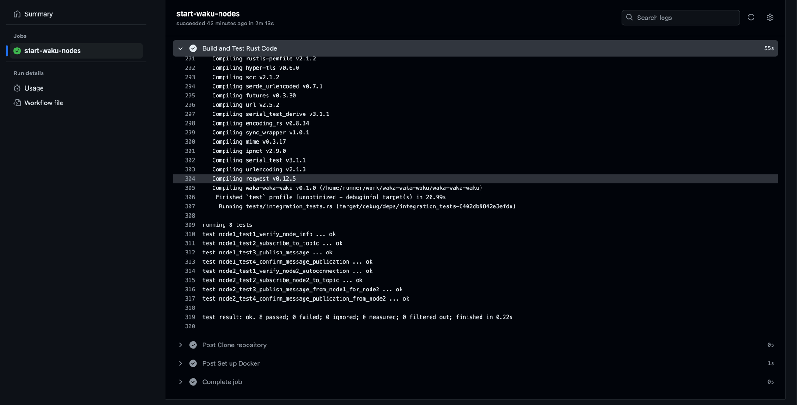

<a name="readme-top"></a>

<!-- PROJECT LOGO -->
<br />
<div align="center">
  <a href="https://github.com/shashankshampi/waka-waka-waku">
    
  </a>

<h3 align="center">waka waka waku</h3>

  <p align="center">
    An awesome DAY to jumpstart your day!
    <br />
    <a href="https://github.com/shashankshampi/waka-waka-waku"><strong>Explore README »</strong></a>
    <br />
    <br />
  </p>
</div>


<!-- TABLE OF CONTENTS -->
<details open>
  <summary>Table of Contents</summary>
  <br>
  <ol>
    <li>
      <a href="#Overview">About The Project</a>
      <ul>
        <li><a href="#Features">Features</a></li>
        <li><a href="#Built-With">Built With</a></li>
      </ul>
    </li>
    <li>
      <a href="#getting-started">Getting Started</a>
      <ul>
        <li><a href="#prerequisites">Prerequisites</a></li>
      </ul>
    </li>
    <li><a href="#usage">Usage</a></li>
    <li><a href="#Building-the-Application">Building the Application</a></li>
  <li><a href="#Command-Line-Flags">Command Line Flags</a></li>
  <li><a href="#Contributing">Contributing</a></li>
    <li><a href="#contact">Contact</a></li>
  </ol>
</details>


<!-- ABOUT THE PROJECT -->

## Overview
waka-waka-waku serves as the testing hub for waku. This rust-based repository excels in conducting functional, integration, and regression tests. Furthermore, its versatility extends to scalability, seamlessly integrating with the Scala-based Gatling repository for rigorous performance testing.

Framework structure
```html
waka-waka-waku/
├── Cargo.toml
├── .github/
│   ├── workflows/
│       └── pipeline.yml
├── src/
│   ├── lib.rs
│   └── main.rs
└── tests/
    └── integration_tests.rs
```

## Features

- **Versatile Testing Capabilities**: waka-waka-waku is basic test framework
- **Seamless Integration**: Used Action pipeline to start docker container for test setup to execute functional, integration and e2e testing.


<p align="right">(<a href="#readme-top">back to top</a>)</p>

[//]: # ([]&#40;https://github.com/shashankshampi/waka-waka-waku&#41;)

### Built With

waka-waka-waku is build on the following Tech Stack.

* [][rust-url]
* [][github-actions-url]
* [][waku-url]

[rust-url]: https://www.rust-lang.org/
[github-actions-url]: https://docs.github.com/en/actions
[waku-url]: https://docs.waku.org/guides/nwaku/run-docker/

<p align="right">(<a href="#readme-top">back to top</a>)</p>


<!-- GETTING STARTED -->

## Getting Started

To start with this project you need to follow the steps as below.

### Prerequisites

Before you begin, ensure you have the following installed:
- Rust 1.66+
- Docker
- JQ

### Library used
 ```
 - reqwest
 - serde
 - serde_json
 - tokio
 - urlencoding
 - serial_test
 ```

<!-- USAGE EXAMPLES -->

## Usage

Clone the repository locally and execute shell file to setup and execute test.
<div align="center">

[//]: # ()
</div>

<p align="right">(<a href="#readme-top">back to top</a>)</p>

## Building the Application

### Build and Execute Test Locally

```shell
sh run.sh
```
### Build and Execute Application via Github Action

To build your application with Github Action and run your test in action runner you can raise your PR against the main and can see the execution.

1. Action URL:

```html
https://github.com/shashankshampi/waka-waka-waku/actions
```

2. Steps to start waku docker nodes with pipeline is written over:

```html
https://github.com/shashankshampi/waka-waka-waku/blob/main/.github/workflows/pipeline.yml
```

3. Check the Test result in action pipeline in step `Build and Test Rust Code`

Sample Run:

```html
https://github.com/shashankshampi/waka-waka-waku/actions/runs/9829568324/job/27134743168
```



<p align="right">(<a href="#readme-top">back to top</a>)</p>

<p align="right">(<a href="#readme-top">back to top</a>)</p>

## Postman collection of waku assignment APIs

[waku.postman_collection.json](files%2Fwaku.postman_collection.json)

<p align="right">(<a href="#readme-top">back to top</a>)</p>

<!-- CONTRIBUTING -->

## Contributing

Contributions are what make the open source community such an amazing place to learn, inspire, and create. Any
contributions you make are **greatly appreciated**.

If you have a suggestion that would make this better, please fork the repo and create a pull request. You can also
simply open an issue with the tag "enhancement".
Don't forget to give the project a star! Thanks again!

1. Fork the Project
2. Create your Feature Branch (`git checkout -b feature/AmazingFeature`)
3. Commit your Changes (`git commit -m 'Add some AmazingFeature'`)
4. Push to the Branch (`git push origin feature/AmazingFeature`)
5. Open a Pull Request

<p align="right">(<a href="#readme-top">back to top</a>)</p>


<!-- CONTACT -->

## Contact

Developer - [@shashank sanket](shashank.sanket1995@gmail.com)

<p align="right">(<a href="#readme-top">back to top</a>)</p>


<!-- MARKDOWN LINKS & IMAGES -->
<!-- https://www.markdownguide.org/basic-syntax/#reference-style-links -->
